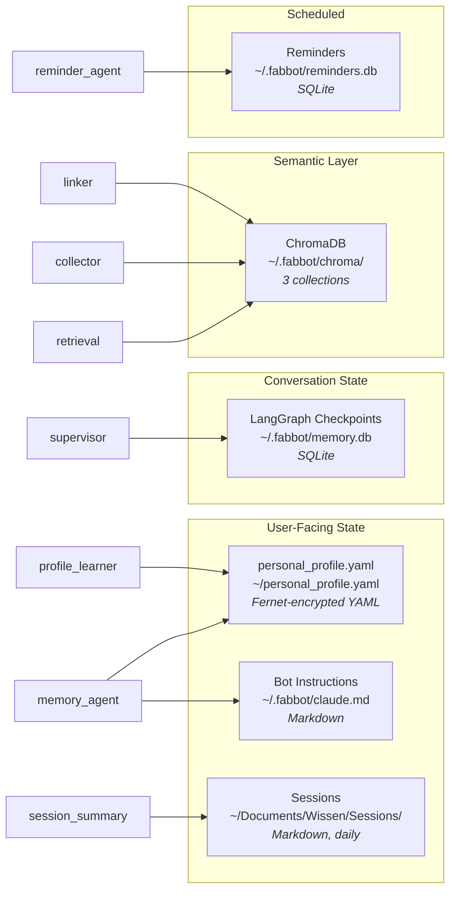

# FabBot - Personal Companion


A personal AI companion that runs locally on macOS, controlled via Telegram. Built with Claude (Anthropic), LangGraph, and a multi-agent architecture.

---

## Overview

```
You → Telegram (text or voice or photo) → Security Guard → Supervisor (Haiku) → calendar_agent / terminal_agent / file_agent / web_agent / chat_agent / vision_agent / ...
```

---

## Features

**Interface & Control** – Telegram bot (text/voice/photo), user authentication (whitelist), human-in-the-loop confirmation for all destructive actions

**Agents** – Terminal (shell commands), File (read/write/list), Web (Tavily+Brave search + fetch), Calendar (Apple), Chat (conversation history + follow-ups), Vision (Claude Sonnet, objects/OCR/scene), Computer Use (screenshot + desktop control), WhatsApp (whatsapp-web.js, HITL, QR via Telegram), Knowledge Clipper (`/clip <URL>` → Obsidian), Knowledge Search (`/search <term>`)

**Memory & Learning** – Persistent conversation memory (SQLite), `personal_profile.yaml` injected into all agents, `/remember` + "Merke dir das" live learning, 3-stage auto-learning pipeline (Detector → Writer → Reviewer), Memory Agent (natural language profile updates), nested Preferences system (`preferences.<subcategory>.<key>`), Session Summary (daily 23:30), Second Brain (ChromaDB semantic retrieval), persistent `claude.md` bot instructions (learnable, survives context trim)

**Voice & Media** – Voice notes (Whisper, local transcription), TTS (OpenAI nova/shimmer + edge-tts fallback, Mac speaker + Telegram voice, `/tts on|off`, `/stop`), media tracking (songs/films/podcasts/books), Weekend Party Report (weekly, 7 Berliner Clubs, Wednesdays 20:00)

**Security** – Two-stage prompt injection guard (pattern + LLM-Guard via Haiku, fail-closed), content isolation for web/clip agents, tamper-evident audit log, at-rest encryption (`personal_profile.yaml` via Fernet + macOS Keychain), SSRF + DNS-Rebinding protection (IPv4 + IPv6 via `getaddrinfo`), SSL validation, path/symlink traversal prevention, subprocess env isolation (no API-key leakage)

**Operations** – GitHub Actions CI (1546 tests), 529 retry (exponential backoff 2s/4s/8s), prompt caching (claude.md + sessions + profile, TTL 60s), context trim (`CHAT_CONTEXT_WINDOW`, default 40), Whisper preload at startup, daily health check (06:00, 11 components), proactive heartbeat (hourly, 6h cooldown), model config via `.env` (`ANTHROPIC_MODEL_SONNET/HAIKU`)

---

## Architecture

```
FabBot/
├── main.py                  # Entrypoint
├── personal_profile.yaml    # Personal profile (local only, not in repo)
├── requirements.txt         # Direct dependencies
├── requirements.lock        # Pinned lock file (pip-compile)
├── requirements-ci.txt      # CI dependencies (no macOS-only packages)
├── .env.example             # Environment variable template
├── review_log.sh            # Daily log summary script
├── .github/workflows/test.yml
├── tests/                   # pytest suite (1546 tests)
├── agent/
│   ├── supervisor.py        # Supervisor – Haiku routing, AsyncSqliteSaver, _PRE_ROUTING_RULES
│   ├── state.py             # LangGraph AgentState
│   ├── llm.py               # get_llm() Sonnet + get_fast_llm() Haiku
│   ├── protocol.py          # Protocol constants (HITL magic strings)
│   ├── security.py          # Two-stage injection guard, weighted scoring, fail-closed
│   ├── audit.py             # Tamper-evident audit log (setup_audit_logger)
│   ├── claude_md.py         # claude.md loader – persistent bot instructions
│   ├── crypto.py            # At-rest encryption via Fernet + macOS Keychain
│   ├── profile.py           # Personal context loader
│   ├── profile_learner.py   # Auto-learning pipeline (Detector → Writer → Reviewer)
│   ├── retrieval.py         # Second Brain – ChromaDB + OpenAI Embeddings
│   ├── node_utils.py        # wrap_agent_node Decorator – last_agent_result/name
│   ├── utils.py             # extract_llm_text + shared helpers
│   ├── telemetry.py         # LangSmith tracing (optional)
│   ├── proactive/
│   │   ├── collector.py     # Entity extraction via Haiku, SHA256-upsert into ChromaDB
│   │   ├── pending.py       # Pending Items Tracker – priority score (due_date/mentions)
│   │   ├── linker.py        # Context Linking – entity_links collection, Cluster-API
│   │   ├── briefing_agent.py# Multi-Agent Briefing Orchestrator (asyncio.gather, 5s timeout)
│   │   ├── heartbeat.py     # Hourly heartbeat, time-triggered, 6h cooldown
│   │   └── context.py       # Proactive context aggregator for chat_agent
│   └── agents/
│       ├── chat_agent.py    # Dynamic prompt – claude.md + sessions + profile + retrieval + proactive
│       ├── memory_agent.py  # Profile updates, delete-aware _review_yaml
│       ├── vision_agent.py  # Image analysis via Claude Sonnet Vision
│       ├── computer.py      # Desktop control (screenshot, apps)
│       ├── terminal.py      # Shell commands, self-correction (MAX_RETRIES=2)
│       ├── file.py          # File operations (read/write/list)
│       ├── web.py           # Web search (Tavily+Brave) + fetch
│       ├── calendar.py      # Apple Calendar (read/create)
│       ├── reminder_agent.py
│       ├── whatsapp_agent.py# WhatsApp via whatsapp-web.js, HITL
│       └── clip_agent.py    # Knowledge Clipper → Obsidian
└── bot/
    ├── bot.py               # Telegram handler, HITL, retry logic, exception handler
    ├── auth.py              # User-Whitelist (fail-closed, RuntimeError if empty)
    ├── confirm.py           # HITL confirmation (full UUID)
    ├── transcribe.py        # Local Whisper transcription
    ├── tts.py               # OpenAI TTS (primary) + edge-tts (fallback)
    ├── search.py            # Local knowledge search
    ├── briefing.py          # Morning Briefing Scheduler (07:30)
    ├── reminders.py         # Reminder storage + proactive delivery
    ├── heartbeat_scheduler.py # Hourly proactivity scheduler
    ├── health_check.py      # Daily health check (06:00, 11 components)
    ├── session_summary.py   # Daily session summary (23:30), TOCTOU-safe
    ├── party_report.py      # Weekend party report (Wednesday 20:00)
    ├── whatsapp.py          # WhatsApp bridge (Node.js process, QR via Telegram)
    └── local_api.py         # Local bot API (status, diagnostics)
```

**Stack:**
- Claude Sonnet – AI backbone (configurable via `ANTHROPIC_MODEL_SONNET`, default: `claude-sonnet-4-6`)
- Claude Haiku – supervisor routing + LLM-Guard (configurable via `ANTHROPIC_MODEL_HAIKU`, default: `claude-haiku-4-5-20251001`)
- LangGraph `1.1.x` – multi-agent state machine with AsyncSqliteSaver
- python-telegram-bot `22.x` – Telegram interface
- openai-whisper – local speech transcription (preloaded at startup)
- OpenAI TTS API – primary TTS (nova, configurable via `OPENAI_TTS_VOICE`, directly via httpx)
- OpenAI Embeddings API – text-embedding-3-small for Second Brain (directly via httpx)
- edge-tts – TTS fallback (de-DE-KatjaNeural)
- ChromaDB `1.5.x` – local vector database for Second Brain (~/.fabbot/chroma/)
- aiosqlite – async SQLite for persistent memory
- Tavily + Brave Search – web search (directly via httpx REST)
- Google Calendar API – calendar_agent via google-api-python-client
- cryptography + keyring – At-Rest-Encryption via Fernet + macOS Keychain
- Python 3.11+, macOS

### Data Stores

FabBot distributes persistent state across **6 primary stores** plus several auxiliary stores for logs, health and tokens. The diagram below maps where each kind of information lives and which modules write to it.



| Store | Path | Format | Content | Written by | Backup |
|-------|------|--------|---------|------------|--------|
| `personal_profile.yaml` | `~/personal_profile.yaml` | YAML (Fernet) | Profile, preferences, learning entries | `memory_agent`, `profile_learner` | yes |
| LangGraph Checkpoints | `~/.fabbot/memory.db` | SQLite | Conversation checkpoints (AsyncSqliteSaver) | LangGraph internal (`supervisor`) | yes |
| ChromaDB | `~/.fabbot/chroma/` | Vector DB | Embeddings, entities, entity_links (3 collections) | `retrieval`, `collector`, `linker` | yes |
| Bot Instructions | `~/.fabbot/claude.md` | Markdown | Persistent system instructions for `chat_agent` | manual / `memory_agent` | optional |
| Sessions | `~/Documents/Wissen/Sessions/` | Markdown | Daily conversation summaries (`YYYY-MM-DD.md`) | `session_summary` | optional |
| Reminders | `~/.fabbot/reminders.db` | SQLite | Due reminders with timestamp | `reminder_agent` | optional |

#### Auxiliary Stores

Derived state, logs and runtime tokens – not part of the semantic memory, but useful for debugging and ops:

| Store | Path | Purpose |
|-------|------|---------|
| Audit Log | `~/.fabbot/audit.log` | Tamper-evident action log (`agent/audit.py`) |
| Main Log | `~/.fabbot/fabbot.log` | Application log, daily rotation (7 days) |
| Chroma Metadata | `~/.fabbot/chroma_meta.json` | Profile-change checksum for embedding refresh |
| Watchdog State | `~/.fabbot/watchdog_state.json` | launchd health snapshot |
| API Health State | `~/.fabbot/api_health_state.json` | Heartbeat status for Anthropic / Tavily / Brave |
| WhatsApp Token | `~/.fabbot/wa_service_token` | WhatsApp session secret |
| Local API Token | `~/.fabbot/local_api_token` | Auth for bot status API |

---

## Setup

### Prerequisites

- Python 3.11+, Anthropic API key, OpenAI API key, Telegram bot token, ffmpeg

### Installation

```bash
git clone https://github.com/fabiomorena/FabBot.git
cd FabBot
python -m venv .venv
source .venv/bin/activate
pip install -r requirements.lock
brew install ffmpeg
```

### Configuration

```bash
cp .env.example .env   # fill in API keys
```

Create your personal profile (not included in repo):

```bash
cp personal_profile.yaml.example personal_profile.yaml   # then edit with your details
```

### macOS Permissions (required)

FabBot runs as a background process and needs explicit permissions to access files and folders.

**Full Disk Access** (for `/search`, `file_agent`, `terminal_agent`):
`System Settings → Privacy & Security → Full Disk Access → + → .venv/bin/python`

**Calendar Access** (for `calendar_agent`, `briefing`):
Start the bot once directly from Terminal (`python main.py`) and send a calendar request via Telegram to trigger the permission dialog.

**Prevent idle sleep** (to keep bot running while away):
```bash
caffeinate -i &   # prevents idle sleep, allows screen lock
```
Note: closing the laptop lid will still suspend the bot. Keep lid open or connect an external display.

### Run

```bash
python main.py        # start bot
.venv/bin/python -m pytest tests/ -v      # Run tests (1546 tests)
```

### Run as Launch Agent

```bash
cp com.fabbot.agent.plist ~/Library/LaunchAgents/
launchctl load ~/Library/LaunchAgents/com.fabbot.agent.plist
launchctl start com.fabbot.agent
tail -f ~/.fabbot/fabbot.log
```

---

## Usage

| Message | Routed to |
|--------|-----------|
| "Was steht morgen in meinem Kalender?" | `calendar_agent` |
| "Erstelle einen Termin morgen um 10 Uhr" | `calendar_agent` |
| "Zeig mir den Inhalt von ~/Downloads" | `file_agent` |
| "Schreibe eine Datei nach ~/Desktop/notiz.txt" | `file_agent` |
| "Wie viel freier Speicher ist noch?" | `terminal_agent` |
| "Was ist heute für ein Datum?" | `chat_agent` → `26.04.2026, 14:30 Uhr` |
| "Welche Prozesse laufen gerade?" | `terminal_agent` |
| "Suche nach den neuesten KI News" | `web_agent` |
| "Wie ist das Wetter in Berlin?" | `web_agent` |
| "Ruf mir die Seite example.com ab" | `web_agent` |
| "Mach einen Screenshot" | `computer_agent` |
| "Öffne Safari" | `computer_agent` |
| "Was habe ich dich gerade gefragt?" | `chat_agent` |
| "Fass das nochmal zusammen" | `chat_agent` |
| "Wo wohne ich?" / "Was sind meine Projekte?" | `chat_agent` → aus Profil |
| "Ich habe heute gut geschlafen" | `chat_agent` |
| "Erinnere mich morgen um 9 Uhr ans Meeting" | `reminder_agent` |
| "Was sind meine offenen Erinnerungen?" | `reminder_agent` |
| "Lösche Erinnerung #3" | `reminder_agent` |
| "Merke dir dass Saporito mein Lieblings-Italiener ist" | `memory_agent` |
| "Füge Marco als Kollegen hinzu" | `memory_agent` |
| "Speichere Insieme von Valentino Vivace als Lieblingslied" | `memory_agent` |
| "Vergiss den Eintrag über Bonial als Projekt" | `memory_agent` |
| 📷 Foto + "Was siehst du?" | `vision_agent` → Objekterkennung, OCR, Beschreibung |
| 📷 Foto + "Was steht hier?" | `vision_agent` → Texterkennung (OCR) |
| 🎤 Voice note | Whisper → any agent |

**Commands:**
```
/start /ask /clip /search /remember /briefing /done /mute_proactive /tts on|off /stop /status /auditlog
```

---

## Personal Context Layer

FabBot uses a local `personal_profile.yaml` to give all agents persistent knowledge about you – projects, preferences, people, routines. This file is not committed to the repo.

```yaml
identity:
  name: Fabio
  location: Berlin, Deutschland

projects:
  active:
    - name: FabBot
      stack: [Python, LangGraph, Telegram]
      priority: high

people:
  - name: Stephanie Priller
    context: Steffi ist Fabios Freundin

preferences:
  communication: prägnant, direkt, technisch
```

**Two context levels:**
- **Short** (Supervisor/Haiku): name + active projects – minimal overhead, routing unaffected
- **Full** (chat_agent/Sonnet): everything including people, notes, preferences

**Live updates via `/remember`:**
```
/remember ich arbeite gerade auch an Projekt X
```
Writes a timestamped note to `personal_profile.yaml`, active immediately without restart.

---

## Security

### Two-stage prompt injection guard

**Stage 1 – Pattern check (free, instant):** Known patterns hard-blocked. Softer patterns increase suspicion score.

**Stage 2 – LLM-Guard via Haiku (only when score > 0):** Returns `SAFE` or `INJECTION`. Fail-closed: Guard errors never block legitimate messages.

### Content isolation

Fetched web content is wrapped in `<document>` tags before LLM processing. HTML comments stripped. Explicit instruction to ignore content inside document tags.

### Additional layers
User whitelist · Homoglyph normalization · Rate limiting · Terminal allowlist · Shell operator blocking · Path traversal guard · SSRF protection · TOCTOU re-validation · HITL confirmation · Audit log

---

## Performance

| Component | Model | Reason |
|---|---|---|
| Supervisor (routing) | claude-haiku-4-5 | ~4x faster, simple classification |
| LLM-Guard (security) | claude-haiku-4-5 | fast, cost-efficient screening |
| All agents (answers) | claude-sonnet-4-6 | full quality for responses |
| Vision Agent | claude-sonnet-4-6 | multimodal vision capability |

~40% faster response time vs. Sonnet-only.

---

## Logging

Logs are written to `~/.fabbot/fabbot.log` with daily rotation (7 days kept).

```bash
tail -f ~/.fabbot/fabbot.log      # live log
./review_log.sh                   # today's summary
./review_log.sh 2026-03-25        # specific date summary
```

---

## Roadmap

- **Phase 1–19** ✅ Foundation – Telegram bot, multi-agent supervisor, terminal/file/web/calendar agents, security guard, audit log, CI, TTS, persistent memory
- **Phase 20–30** ✅ Hardening – async fixes, morning briefing, HITL improvements, code quality, watchdog
- **Phase 31–40** ✅ Personal Context – personal_profile.yaml, /remember, auto-learning pipeline, 529 retry
- **Phase 41–50** ✅ Security & Memory – security test suite, memory agent, media tracking, at-rest encryption
- **Phase 51–60** ✅ Vision & TTS – Vision Agent, session summary, ElevenLabs→OpenAI TTS migration, weekend party report, dedup fix
- **Phase 61–70** ✅ claude.md & TTS – persistent bot instructions, learnable via "Merke dir das", TTS hardening, model via .env
- **Phase 71–80** ✅ Routing & Knowledge – supervisor routing fix, Second Brain (ChromaDB), natural language passthrough, morning briefing fix, stability fixes
- **Phase 81–90** ✅ WhatsApp & Security – WhatsApp Agent (whatsapp-web.js), auth fail-closed, rate limiting, LangSmith telemetry, watchdog fixes
- **Phase 91–99** ✅ Hardening & Refactor – crypto/audit/llm hardening, GitHub Issues workflow, Prompt-Cache TTL 60s, model validation at startup, memory_agent Registry-Pattern, deque dedup, get_current_datetime() Europe/Berlin, State-Transfer last_agent_result/last_agent_name
- **Phase 100–116** ✅ Stabilization & Bug-Fixes – Duplicate Responses fix, weather via wttr.in, drop_pending_updates + ThrottleInterval, _invoke_locks Race Condition, web_agent weather routing, Supervisor Early-Return, memory_agent generic delete, computer_agent Regex-Intent-Parse, _review_yaml delete-aware (all categories), Sonnet default to claude-sonnet-4-6, _MODEL_PATTERN optional date; 881 tests green
- **Phase 117–124** ✅ Bug-Fixes & Refactoring – screenshot context for chat_agent, web_agent AIMessage-Fix, Preferences system with auto-categorization, Supervisor routing refactor + prompt leak fix, MemoryUpdateResult-Refactor, bot_instruction delete routing, memory_agent clarify-Fix, Duplicate-Scheduler-Fix (launchd/caffeinate)
- **Phase 125–129** ✅ Code-Review & Hardening – file_agent expanduser + launchd HOME, terminal_agent free-text block, GraphRecursionError handler, Scheduler done_callbacks, web.py prompt injection escaping, subprocess env isolation, watchdog/auditlog/file size fixes, weather location from profile
- **Phase 130–139** ✅ Security & Routing Hardening – DNS-Rebinding IPv6, web.py Exception-Handler (404/503/DNS), LLM-Guard Weighted Scoring (strong/weak patterns), PID-File instance check, Health Check expanded to 11 components, _PRE_ROUTING_RULES table, wrap_agent_node Decorator, _invoke_with_retry backoff on APIConnectionError + RateLimitError
- **Phase 140–149** ✅ Second Brain & Proactivity – Context Collector (Haiku, ChromaDB entities), Pending Items Tracker (priority score), Morning Briefing on ChromaDB, Context Linking (entity_links), Multi-Agent Briefing Orchestrator (asyncio.gather + 5s timeout), Heartbeat + trigger-based proactivity (6h cooldown), Proactive Context Aggregator, terminal_agent Self-Correction (MAX_RETRIES=2), Retrieval Hardening (rolling window, sessions from index)
- **Phase 150–159** ✅ Stabilization & Hardening – briefing timeouts per section, calendar system filter, model IDs centralized (.env), Heartbeat with profile/memory/session context, /phase bot restart, forget article pattern fix, PHOTO pre-routing deterministic + agent registration consolidated, RuntimeError handler + Proto-Import top-level + cleanup_checkpoints concurrency guard, system_agent via psutil (CPU/RAM/Disk), API Health-Check in Heartbeat (Anthropic/Tavily/Brave); 1272 tests green
- **Phase 160–169** ✅ Features & Bug-Fixes – Startup-Message on restart, Bug-Fixes #110–#114, Intent-Extraction via Haiku (Commitments in ChromaDB), Collector-Refactor (intent/person/place getrennt), Anthropic Prompt Caching (cache_control), Context-Injection-Fix (proactive messages in state), Supervisor Context Routing (last_agent_name), Weather Forecast by Day (wttr.in index), web.py hourly Bounds-Check, Photo follow-up Supervisor-Guard + vision_agent_name in State; 1296 tests green
- **Phase 170–179** ✅ Security, CI & Robustheit – Security Fixes (injection protection supervisor/memory/terminal), Bandit CI + weekly pip-audit, Multi-instance fcntl.flock + news freshness, _invoke_locks LRU-Eviction + Scheduler Liveness + Data Store Diagram, ruff CI + codebase formatting (91 files), Supervisor routing pipeline refactor (_PRE_ROUTE_PIPELINE), Self-Healing Watchdog Auto-Restart (launchctl), Memory-Reviewer Truncation-Bug fix (_is_valid_save superset-check), Race-Condition-Fix + Frozen-Snapshot in write_profile(), Fork-Agent Learning Loop (Batch-Analyse alle N Turns); 1341 tests green
- **Phase 180–187** ✅ Proaktivität & Memory – Node.js 24 Migration, Background Curator (wöchentliche Profil-Konsolidierung + Hotfix-Serie), Beziehungs-Alert (ChromaDB $lt-Filter, 14d/30d Schwellwerte), Memory-Parser zweistufig (Haiku-Router + Sonnet-Extractor), Curator Review-Fixes, Supervisor Routing Fix (#161), merke-dir-das Profil-Fakt vs. Bot-Instruktion (#164); 1452 tests green
- **Phase 188** ✅ Memory-Agent Note-Fallback bei YAML-Review-Fehler – YAML-Review INVALID löst nicht mehr User-Fehlermeldung aus, sondern Note-Fallback (Daten gehen nicht verloren); Supervisor-Prompt um transiente Sozialereignisse mit Namen erweitert; 1452 tests green
- **Phase 189** ✅ Telegram-Anhänge: PDF + Standort – PDF-Dateien via pymupdf extrahiert und an Claude weitergeleitet (20 MB Limit, 100k Zeichen-Cap, Caption-Support); Standort-Handler für filters.LOCATION registriert (Koordinaten als [Standort]-Text an Graph); on_document auf filters.Document.ALL erweitert; 1465 tests green
- **Phase 190** ✅ Audio-Transkription + YouTube-Agent – filters.AUDIO Handler + _handle_document_audio für audio/* MIME-Typen via Whisper-Pipeline (#138); eigenständiger youtube_agent mit zweistufiger Logik (youtube-transcript-api → yt-dlp + Whisper-Fallback), Pre-Routing via _pre_route_youtube (#144); 1485 tests green
- **Phase 191** ✅ Musik-Erkennung bei Audio-Transkription – NoSpeechDetectedError via Whisper no_speech_prob + Unicode-Script-Heuristik; klare Fehlermeldung statt Halluzinations-Transkript bei Musik-Dateien; 1485 tests green
- **Phase 192** ✅ Audio-Dokument Caption-Support – Caption bei audio/* Dokumenten wird als Benutzeranweisung an den Agenten weitergegeben (analog PDF-Handler); sanitize_input_async für Caption; Transkript + Caption als strukturierter Text; 1486 tests green
- **Phase 193** ✅ Bug-Fixes & Security-Enforcement – _truncate_profile_yaml hard-truncate Fallback wenn erste Sektion > 8000 Zeichen (#181); Fork-Agent Batch-Learning Log-Level DEBUG→INFO (#147); AST-basierter Enforcement-Test für sanitize_input_async in allen MessageHandlern + PR-Template (#182); 1497 tests green
- **Phase 194** ✅ Test-Isolation Heartbeat – test_skips_when_no_triggers patcht run_api_health_check + find_unmentioned_entities um echte Dateisystem-/HTTP-Zugriffe zu unterbinden; verhindert flakigen Lokalfehler durch lokalen api_health_state.json; 1498 tests green
- **Phase 195** ✅ Companion/Proaktivität – Tageszeit-Guard (22:00–08:00 Berlin, is_quiet_hours) verhindert nächtliche Heartbeat-Nachrichten (#103); täglicher Abend-Check-in um 21:00 Uhr mit personalisierter LLM-Frage auf Basis des Tagesgesprächs, eigener State-Datei, unabhängig vom 6h-Cooldown (#109); 1513 tests green
- **Phase 196** ✅ Musik-Analyse mit Essentia + librosa – BPM via RhythmExtractor2013, Key via KeyExtractor (Krumhansl-Schmuckler + Temperley) + librosa Chroma-Cross-Check, Energie/RMS/Spektrum; NoSpeechDetectedError in on_audio + _handle_document_audio löst automatisch Musik-Analyse aus statt Fehlermeldung; music_analysis_agent als LangGraph-Agent + deterministisches Pre-Routing [MUSIK-ANALYSE]; M3-native arm64-Wheel; closes #180; 1528 tests green
- **Phase 197** ✅ Musik-Analyse → Chat-Bot-Übergabe – _update_music_memory() analog _update_vision_memory() speichert Analyse-Ergebnis im LangGraph-State; on_audio + _handle_document_audio schreiben nach Analyse caption + formatted result in den Gesprächskontext; Follow-up-Fragen zur analysierten Datei funktionieren jetzt wie bei Bildanalyse; 1528 tests green
- **Phase 198** ✅ SecretStr & Review-Fixes – telegram_bot_token/openai_api_key/tavily_api_key/brave_api_key auf SecretStr migriert (Keys in Logs maskiert); ANTHROPIC_API_KEY-Kommentar in config.py; evening_checkin date.today() → Berlin-aware; hour/minute-Caching dokumentiert; essentia Dev-Build-Kommentar in requirements.txt; 1528 tests green
- **Phase 199** ✅ Briefing News via RSS – Tavily-News-Fetch ersetzt durch direkte RSS-Feeds (tagesschau.de, spiegel.de, zeit.de); verhindert UI-Artefakte/Homepage-Inhalte die Tavily bei include_domains lieferte; 1527 tests green
- **Phase 200** ✅ Bugfixes & UX-Improvements – Curator-Dry-Run sendet Report nur bei geänderten Operationen (MD5-Hash-Vergleich); Whisper-Fallback zeigt Zwischenstatus im Chat via _bot_bridge; caffeinate-Watchdog überwacht Prozess und startet bei Absturz neu (bot/caffeinate.py); yt-dlp auf >= gelockert (#183); NamedTemporaryFile Windows-Caveat kommentiert (#184); closes #175, #183, #184, #197; 1528 tests green
- **Phase 201** ✅ Event-Kategorie + Curator Preference-Fix – neues category=event im Memory-Router für einmalige Handlungen ("habe X gekauft/getan/erledigt"); event.md Skill-Prompt; save/delete-Handler speichert Events als Liste unter events.*; Curator erkennt falsch kategorisierte Preferences via misclassified_preferences (neue Analyse-Kategorie im LLM-Prompt); _build_proposal archiviert fehlerhafte Einträge und bereinigt leere Subcategories; format_report zeigt neue Kategorie; closes #202, #205; 1546 tests green
- **Phase 202** ✅ Evening Check-in Conversation-Aware – _last_activity Dict trackt letzten Aktivitäts-Zeitstempel pro chat_id (record_activity in handle_message_text, on_photo, on_document); evening_checkin erkennt aktives Gespräch (< 20 Min Inaktivität) und verzögert Check-in um 15 Min, max. 3 Retries; generierte Frage nutzt stets den aktuellen State nach dem Warten; 1546 tests green
- **Phase 203** ✅ Briefing-Dedup + Evening Check-in Anti-Halluzination – _deduplicate_items() in pending.py entfernt thematisch ähnliche Offene-Punkte-Einträge per Keyword-Cluster (transitiv); evening_checkin filtert Briefing-Messages aus Kontext, Early-Return bei leerem Kontext, strikter Anti-Halluzinations-Prompt; Issues #211 #212; 1549 tests green
- **Phase 204** ✅ Anti-Halluzination Pro – Post-Generation Entity Guard (_has_hallucination prüft LLM-Output gegen Kontext-Whitelist, erfundene Namen → Fallback); get_grounding_llm() mit temperature=0 für deterministisches Grounding; Whitelist-Injection im Prompt (erlaubte Entitäten aus Kontext); Issues #214 #215 #216; 1570 tests green
- **Phase 205** ✅ Watchdog Logging – 13 print()-Aufrufe in watchdog.py durch strukturiertes logging ersetzt (basicConfig stdout, ISO-Timestamp, Level-Steuerung); LOG_PREFIX entfernt; log levels: info/warning/error/critical je nach Schwere; Issue #218; 1570 tests green
- **Phase 206** ✅ Context-Overhead Reduction – CHAT_CONTEXT_WINDOW Default 40→20 (#229); Sessions-Doppelladung entfernt (load_session_summaries aus statischem Prompt, #228); last_agent_result auf 2000 Zeichen truncated (#227); CLAUDE.md auf 24 Non-Blank-Zeilen gekürzt (#226); 1570 tests green
- **Phase 207** ✅ .gitignore erweitern – SQLite-Artefakte (*.db, *.db-shm, *.db-wal), .fabbot/, Test-Artefakte (.pytest_cache/, htmlcov/, .coverage), lokale Konfig (*.local.yaml, *.local.env), open-issues.html; Issue #222; 1570 tests green
- **Phase 208** ✅ Type-Safety – AgentState auf NotRequired umgestellt (48 typeddict-item Fehler); assert-Guards in 20 Telegram-Handlern (88 union-attr Fehler); RunnableConfig für aupdate_state/ainvoke (6 Dateien); Neben-Fixes: PIL.Resampling.LANCZOS, tts.py return-Pfad, BaseException-Check; Mypy 176 → 0 Fehler; Issue #219; 1569 tests green
- **Phase 209** ✅ Pre-Commit Hooks + Ruff E741 – .pre-commit-config.yaml mit ruff, ruff-format, mypy, bandit (alle local/system); E741 aus ruff ignore entfernt, 14 `l`→`line` Umbenennungen in 7 Dateien; [tool.mypy] ignore_missing_imports=true in pyproject.toml; bot/local_api.py Queue|None-Fix; Issues #220 #221; 1570 tests green
- **Phase 210** ✅ Kostenoptimierung: Session-Summaries kürzen – SESSION_SUMMARY_MAX_CHARS (Default 600) via .env konfigurierbar; _load_all_sessions() truncated pro Summary auf max N Zeichen; Issue #115; 1572 tests green
- **Phase 211** ✅ Memory-Architektur-Diagramm in README – Mermaid-Diagramm der 6 Haupt-Stores; Tabellen-Bugfixes (claude.md-Pfad `~/.fabbot/claude.md`, Sessions-Großschreibung, reminders.json→reminders.db); Auxiliary-Stores-Sektion (audit.log, fabbot.log, chroma_meta.json, watchdog_state.json, api_health_state.json, Tokens); Folge-Issues #238 (Sessions+Reminder→SQLite) und #239 (Memory-Interface); Issue #128; 1572 tests green
- **Phase 212** ✅ HITL via LangGraph `interrupt()` für terminal + file – Magic-String-Returns `__CONFIRM_TERMINAL__:` und `__CONFIRM_FILE_WRITE__:` durch echte Pregel-Interrupts ersetzt; `bot.py._handle_interrupt()` als Brücke zwischen Pregel-Pause und Telegram-Confirmation; `Command(resume={confirmed, command/path/content, rate_limit_ok})` führt Graph fort; `terminal_agent` + `_write_file_with_hitl` nutzen `decision[...]` defensiv gegen LLM-Drift bei Re-Execution; `_RESPONSE_DISPATCH` enthält nur noch computer/calendar/whatsapp; Issue #129; 1581 tests green
- **Phase 213** ✅ Heartbeat kennt aktuelles Datum + Aufenthaltsort – `_get_today_str()` liefert Berlin-Datum; `_fetch_location_ctx()` fragt Memory nach Standort/Aufenthalt; beide Prompt-Builder (`_build_time_trigger_prompt`, `_build_relationship_alert_prompt`) enthalten explizites `Heute:`-Datum, `=== Aktueller Aufenthalt ===`-Sektion und Regel gegen falsche „steht bevor"-Formulierungen; `_gather_heartbeat_context` lädt 4 Quellen parallel; Issue #248; 1601 tests green
- **Phase 214** ✅ Gustav-Fix: Kommando-Empfänger nicht als Entität speichern + Relationship-Alert nur ab 2 Mentions – `_EXTRACTION_PROMPT` in `collector.py` schließt Personen aus Kommando-Mustern aus („Sende an X", „Ruf Y an"); `relationship_alert.py` führt `MIN_MENTION_COUNT = 2` ein und ergänzt `{"mention_count": {"$gte": 2}}` in `_query_unmentioned`; Issues #246 + #247; 1608 tests green
- **Phase 215** ✅ Briefing-Fixes: Wetter auf Open-Meteo + News-Timeout + Party-Report RA-Scraping – `_get_weather_berlin()` nutzt Open-Meteo API (genaue Humidity statt wttr.in 100%-Bug); News-LLM-Timeout von 20s auf 30s + Orchestrator-Timeout von 30s auf 45s; `_fetch_ra_page()` extrahiert `__NEXT_DATA__` JSON aus Next.js-SSR-Pages statt HTML-Stripping (script-Tags bisher komplett verworfen); 1619 tests green
- **Phase 216** ✅ Context-Window: Anchor-Messages + Inline-Komprimierung – `_apply_context_window()` ersetzt einfaches `[-N:]`-Slicing; erste Nachricht (Gesprächsthema) bleibt immer erhalten (#231); Overflow-Messages zwischen Anchor und Recent werden per Haiku zu kompakter SystemMessage komprimiert (#232); Timeout/LLM-Fehler-Fallback auf Rohtext; Issues #231 + #232; 1630 tests green
- **Phase 217** ✅ Config-Cleanup: langchain_api_key als SecretStr + Media-Limits konfigurierbar – `langchain_api_key` auf `SecretStr` migriert (letztes verbleibendes str-Key-Feld nach Phase 198); 5 Magic-Number-Konstanten (`_IMAGE_MAX_PX/BYTES`, `_PDF_MAX_BYTES/CHARS`, `_AUDIO_MAX_BYTES`) aus `bot/bot.py` und `vision_agent.py` in `agent/config.py` zentralisiert und via `.env` konfigurierbar; `telemetry.py` auf `.get_secret_value()` umgestellt; `.env.example` um Media-Limits-Sektion erweitert; Issues #208 + #209; 1648 tests green
- **Phase 218** ✅ Self-Knowledge: Bot kennt seine eigene Architektur – `SELF.md` im Projektroot mit Agenten-Übersicht (13 Nodes), LLM-Konfiguration (get_llm/get_fast_llm/get_grounding_llm inkl. Begründungen für temperature=0), Prompt-Aufbau, Memory-Quellen, Security-Architektur und Architektur-Entscheidungen; `load_self_md()` in `chat_agent.py` lädt SELF.md in den gecachten statischen Prompt-Block (vor claude.md); Issue #225; 1655 tests green
- **Phase 219** ✅ Entity Guard DRY + konfigurierbarer agent_result TTL – `entity_guard.py` aus `evening_checkin.py` extrahiert (Phase 204 DRY); `heartbeat.py` bekommt `temperature=0` + Post-Generation Entity Guard gegen halluzinierte Entitäten; `briefing.py` News-LLM auf `temperature=0`; `agent_result_max_chars` und `agent_result_ttl_turns` via `.env` konfigurierbar; `last_agent_result_turn` im State trackt verbleibende Turns (Multi-Turn-Kontext); Issues #259 + #260; 1680 tests green
- **Phase 220** ✅ Coverage-Ausbau: Tests für 0%-Module + memory_agent/retrieval Helfer – 7 neue Testdateien (123 Tests); `chat_agent.py`, `telemetry.py`, `caffeinate.py`, `curator_scheduler.py` auf 100%; `local_api.py` auf 85%; `memory_agent.py` von 49% auf 67%, `retrieval.py` von 46% auf 63%; Gesamt 64%→66%; vulture+ruff in `/phase` integriert (ruff/vulture als Gate+Info); `vulture>=2.0` + `pytest-cov>=5.0.0` in `requirements-ci.txt`; 1803 tests green
- **Phase 221** ✅ Curator idle-detection via SQLite-Timestamp + Focus-Mode-Detektor – `get_idle_seconds()` liest aus `~/.fabbot/activity.json` statt mtime (Issues #210); `record_activity()` in `bot.py` persistiert UTC-Timestamp nach `activity.json`; neues `agent/proactive/focus_mode.py`: `NORMAL/SOFT_MUTE/HARD_MUTE` nach 15/60 min Inaktivität; `is_focus_muted()` mit `priority`-Parameter; Heartbeat-Scheduler prüft Focus-Mode vor proaktiven Nachrichten (Issue #104); `FOCUS_SOFT_MUTE_MIN`/`FOCUS_HARD_MUTE_MIN` via `.env` konfigurierbar; 16 neue Tests; 1819 tests green

---

## License

Private project – not licensed for public use