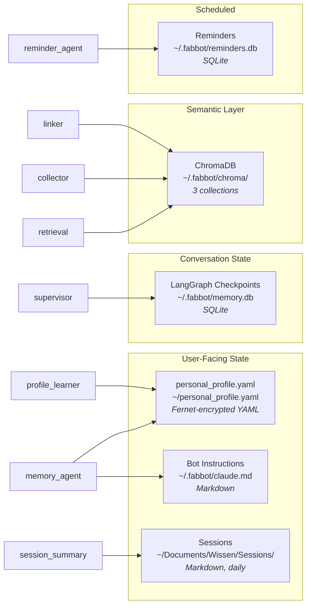

# FabBot - Personal Companion


A personal AI companion that runs locally on macOS, controlled via Telegram. Built with Claude (Anthropic), LangGraph, and a multi-agent architecture.

---

## Overview

```
You → Telegram (text or voice or photo) → Security Guard → Supervisor (Haiku) → calendar_agent / terminal_agent / file_agent / web_agent / chat_agent / vision_agent / ...
```

---

## Features

**Interface & Control** – Telegram bot (text/voice/photo), user authentication (whitelist), human-in-the-loop confirmation for all destructive actions

**Agents** – Terminal (shell commands), File (read/write/list), Web (Tavily+Brave search + fetch), Calendar (Apple), Chat (conversation history + follow-ups), Vision (Claude Sonnet, objects/OCR/scene), Computer Use (screenshot + desktop control), WhatsApp (whatsapp-web.js, HITL, QR via Telegram), Knowledge Clipper (`/clip <URL>` → Obsidian), Knowledge Search (`/search <term>`)

**Memory & Learning** – Persistent conversation memory (SQLite), `personal_profile.yaml` injected into all agents, `/remember` + "Merke dir das" live learning, 3-stage auto-learning pipeline (Detector → Writer → Reviewer), Memory Agent (natural language profile updates), nested Preferences system (`preferences.<subcategory>.<key>`), Session Summary (daily 23:30), Second Brain (ChromaDB semantic retrieval), persistent `claude.md` bot instructions (learnable, survives context trim)

**Voice & Media** – Voice notes (Whisper, local transcription), TTS (OpenAI nova/shimmer + edge-tts fallback, Mac speaker + Telegram voice, `/tts on|off`, `/stop`), media tracking (songs/films/podcasts/books), Weekend Party Report (weekly, 7 Berliner Clubs, Wednesdays 20:00)

**Security** – Two-stage prompt injection guard (pattern + LLM-Guard via Haiku, fail-closed), content isolation for web/clip agents, tamper-evident audit log, at-rest encryption (`personal_profile.yaml` via Fernet + macOS Keychain), SSRF + DNS-Rebinding protection (IPv4 + IPv6 via `getaddrinfo`), SSL validation, path/symlink traversal prevention, subprocess env isolation (no API-key leakage)

**Operations** – GitHub Actions CI (1834 tests), 529 retry (exponential backoff 2s/4s/8s), prompt caching (claude.md + sessions + profile, TTL 60s), context trim (`CHAT_CONTEXT_WINDOW`, default 20), Whisper preload at startup, daily health check (06:00, 11 components), proactive heartbeat (hourly, 6h cooldown, focus-mode aware), model config via `.env` (`ANTHROPIC_MODEL_SONNET/HAIKU`)

---

## Architecture

```
FabBot/
├── main.py                  # Entrypoint
├── personal_profile.yaml    # Personal profile (local only, not in repo)
├── requirements.txt         # Direct dependencies
├── requirements.lock        # Pinned lock file (pip-compile)
├── requirements-ci.txt      # CI dependencies (no macOS-only packages)
├── .env.example             # Environment variable template
├── review_log.sh            # Daily log summary script
├── .github/workflows/test.yml
├── tests/                   # pytest suite (1834 tests)
├── agent/
│   ├── supervisor.py        # Supervisor – Haiku routing, AsyncSqliteSaver, _PRE_ROUTING_RULES
│   ├── state.py             # LangGraph AgentState
│   ├── llm.py               # get_llm() Sonnet + get_fast_llm() Haiku
│   ├── protocol.py          # Protocol constants (HITL magic strings)
│   ├── security.py          # Two-stage injection guard, weighted scoring, fail-closed
│   ├── audit.py             # Tamper-evident audit log (setup_audit_logger)
│   ├── claude_md.py         # claude.md loader – persistent bot instructions
│   ├── crypto.py            # At-rest encryption via Fernet + macOS Keychain
│   ├── profile.py           # Personal context loader
│   ├── profile_learner.py   # Auto-learning pipeline (Detector → Writer → Reviewer)
│   ├── retrieval.py         # Second Brain – ChromaDB + OpenAI Embeddings
│   ├── node_utils.py        # wrap_agent_node Decorator – last_agent_result/name
│   ├── utils.py             # extract_llm_text + shared helpers
│   ├── telemetry.py         # LangSmith tracing (optional)
│   ├── proactive/
│   │   ├── collector.py     # Entity extraction via Haiku, SHA256-upsert into ChromaDB
│   │   ├── pending.py       # Pending Items Tracker – priority score (due_date/mentions)
│   │   ├── linker.py        # Context Linking – entity_links collection, Cluster-API
│   │   ├── briefing_agent.py# Multi-Agent Briefing Orchestrator (asyncio.gather, 5s timeout)
│   │   ├── heartbeat.py     # Hourly heartbeat, time-triggered, 6h cooldown
│   │   └── context.py       # Proactive context aggregator for chat_agent
│   └── agents/
│       ├── chat_agent.py    # Dynamic prompt – claude.md + sessions + profile + retrieval + proactive
│       ├── memory_agent.py  # Profile updates, delete-aware _review_yaml
│       ├── vision_agent.py  # Image analysis via Claude Sonnet Vision
│       ├── computer.py      # Desktop control (screenshot, apps)
│       ├── terminal.py      # Shell commands, self-correction (MAX_RETRIES=2)
│       ├── file.py          # File operations (read/write/list)
│       ├── web.py           # Web search (Tavily+Brave) + fetch
│       ├── calendar.py      # Apple Calendar (read/create)
│       ├── reminder_agent.py
│       ├── whatsapp_agent.py# WhatsApp via whatsapp-web.js, HITL
│       └── clip_agent.py    # Knowledge Clipper → Obsidian
└── bot/
    ├── bot.py               # Telegram handler, HITL, retry logic, exception handler
    ├── auth.py              # User-Whitelist (fail-closed, RuntimeError if empty)
    ├── confirm.py           # HITL confirmation (full UUID)
    ├── transcribe.py        # Local Whisper transcription
    ├── tts.py               # OpenAI TTS (primary) + edge-tts (fallback)
    ├── search.py            # Local knowledge search
    ├── briefing.py          # Morning Briefing Scheduler (07:30)
    ├── reminders.py         # Reminder storage + proactive delivery
    ├── heartbeat_scheduler.py # Hourly proactivity scheduler
    ├── health_check.py      # Daily health check (06:00, 11 components)
    ├── session_summary.py   # Daily session summary (23:30), TOCTOU-safe
    ├── party_report.py      # Weekend party report (Wednesday 20:00)
    ├── whatsapp.py          # WhatsApp bridge (Node.js process, QR via Telegram)
    └── local_api.py         # Local bot API (status, diagnostics)
```

**Stack:**
- Claude Sonnet – AI backbone (configurable via `ANTHROPIC_MODEL_SONNET`, default: `claude-sonnet-4-6`)
- Claude Haiku – supervisor routing + LLM-Guard (configurable via `ANTHROPIC_MODEL_HAIKU`, default: `claude-haiku-4-5-20251001`)
- LangGraph `1.1.x` – multi-agent state machine with AsyncSqliteSaver
- python-telegram-bot `22.x` – Telegram interface
- openai-whisper – local speech transcription (preloaded at startup)
- OpenAI TTS API – primary TTS (nova, configurable via `OPENAI_TTS_VOICE`, directly via httpx)
- OpenAI Embeddings API – text-embedding-3-small for Second Brain (directly via httpx)
- edge-tts – TTS fallback (de-DE-KatjaNeural)
- ChromaDB `1.5.x` – local vector database for Second Brain (~/.fabbot/chroma/)
- aiosqlite – async SQLite for persistent memory
- Tavily + Brave Search – web search (directly via httpx REST)
- Google Calendar API – calendar_agent via google-api-python-client
- cryptography + keyring – At-Rest-Encryption via Fernet + macOS Keychain
- Python 3.11+, macOS

### Data Stores

FabBot distributes persistent state across **6 primary stores** plus several auxiliary stores for logs, health and tokens. The diagram below maps where each kind of information lives and which modules write to it.



| Store | Path | Format | Content | Written by | Backup |
|-------|------|--------|---------|------------|--------|
| `personal_profile.yaml` | `~/personal_profile.yaml` | YAML (Fernet) | Profile, preferences, learning entries | `memory_agent`, `profile_learner` | yes |
| LangGraph Checkpoints | `~/.fabbot/memory.db` | SQLite | Conversation checkpoints (AsyncSqliteSaver) | LangGraph internal (`supervisor`) | yes |
| ChromaDB | `~/.fabbot/chroma/` | Vector DB | Embeddings, entities, entity_links (3 collections) | `retrieval`, `collector`, `linker` | yes |
| Bot Instructions | `~/.fabbot/claude.md` | Markdown | Persistent system instructions for `chat_agent` | manual / `memory_agent` | optional |
| Sessions | `~/Documents/Wissen/Sessions/` | Markdown | Daily conversation summaries (`YYYY-MM-DD.md`) | `session_summary` | optional |
| Reminders | `~/.fabbot/reminders.db` | SQLite | Due reminders with timestamp | `reminder_agent` | optional |

#### Auxiliary Stores

Derived state, logs and runtime tokens – not part of the semantic memory, but useful for debugging and ops:

| Store | Path | Purpose |
|-------|------|---------|
| Audit Log | `~/.fabbot/audit.log` | Tamper-evident action log (`agent/audit.py`) |
| Main Log | `~/.fabbot/fabbot.log` | Application log, daily rotation (7 days) |
| Chroma Metadata | `~/.fabbot/chroma_meta.json` | Profile-change checksum for embedding refresh |
| Watchdog State | `~/.fabbot/watchdog_state.json` | launchd health snapshot |
| API Health State | `~/.fabbot/api_health_state.json` | Heartbeat status for Anthropic / Tavily / Brave |
| WhatsApp Token | `~/.fabbot/wa_service_token` | WhatsApp session secret |
| Local API Token | `~/.fabbot/local_api_token` | Auth for bot status API |

---

## Setup

### Prerequisites

- Python 3.11+, Anthropic API key, OpenAI API key, Telegram bot token, ffmpeg

### Installation

```bash
git clone https://github.com/fabiomorena/FabBot.git
cd FabBot
python -m venv .venv
source .venv/bin/activate
pip install -r requirements.lock
brew install ffmpeg
```

### Configuration

```bash
cp .env.example .env   # fill in API keys
```

Create your personal profile (not included in repo):

```bash
cp personal_profile.yaml.example personal_profile.yaml   # then edit with your details
```

### macOS Permissions (required)

FabBot runs as a background process and needs explicit permissions to access files and folders.

**Full Disk Access** (for `/search`, `file_agent`, `terminal_agent`):
`System Settings → Privacy & Security → Full Disk Access → + → .venv/bin/python`

**Calendar Access** (for `calendar_agent`, `briefing`):
Start the bot once directly from Terminal (`python main.py`) and send a calendar request via Telegram to trigger the permission dialog.

**Prevent idle sleep** (to keep bot running while away):
```bash
caffeinate -i &   # prevents idle sleep, allows screen lock
```
Note: closing the laptop lid will still suspend the bot. Keep lid open or connect an external display.

### Run

```bash
python main.py        # start bot
.venv/bin/python -m pytest tests/ -v      # Run tests (1834 tests)
```

### Run as Launch Agent

```bash
cp com.fabbot.agent.plist ~/Library/LaunchAgents/
launchctl load ~/Library/LaunchAgents/com.fabbot.agent.plist
launchctl start com.fabbot.agent
tail -f ~/.fabbot/fabbot.log
```

---

## Usage

| Message | Routed to |
|--------|-----------|
| "Was steht morgen in meinem Kalender?" | `calendar_agent` |
| "Erstelle einen Termin morgen um 10 Uhr" | `calendar_agent` |
| "Zeig mir den Inhalt von ~/Downloads" | `file_agent` |
| "Schreibe eine Datei nach ~/Desktop/notiz.txt" | `file_agent` |
| "Wie viel freier Speicher ist noch?" | `terminal_agent` |
| "Was ist heute für ein Datum?" | `chat_agent` → `26.04.2026, 14:30 Uhr` |
| "Welche Prozesse laufen gerade?" | `terminal_agent` |
| "Suche nach den neuesten KI News" | `web_agent` |
| "Wie ist das Wetter in Berlin?" | `web_agent` |
| "Ruf mir die Seite example.com ab" | `web_agent` |
| "Mach einen Screenshot" | `computer_agent` |
| "Öffne Safari" | `computer_agent` |
| "Was habe ich dich gerade gefragt?" | `chat_agent` |
| "Fass das nochmal zusammen" | `chat_agent` |
| "Wo wohne ich?" / "Was sind meine Projekte?" | `chat_agent` → aus Profil |
| "Ich habe heute gut geschlafen" | `chat_agent` |
| "Erinnere mich morgen um 9 Uhr ans Meeting" | `reminder_agent` |
| "Was sind meine offenen Erinnerungen?" | `reminder_agent` |
| "Lösche Erinnerung #3" | `reminder_agent` |
| "Merke dir dass Saporito mein Lieblings-Italiener ist" | `memory_agent` |
| "Füge Marco als Kollegen hinzu" | `memory_agent` |
| "Speichere Insieme von Valentino Vivace als Lieblingslied" | `memory_agent` |
| "Vergiss den Eintrag über Bonial als Projekt" | `memory_agent` |
| 📷 Foto + "Was siehst du?" | `vision_agent` → Objekterkennung, OCR, Beschreibung |
| 📷 Foto + "Was steht hier?" | `vision_agent` → Texterkennung (OCR) |
| 🎤 Voice note | Whisper → any agent |

**Commands:**
```
/start /ask /clip /search /remember /briefing /done /mute_proactive /tts on|off /stop /status /auditlog
```

---

## Personal Context Layer

FabBot uses a local `personal_profile.yaml` to give all agents persistent knowledge about you – projects, preferences, people, routines. This file is not committed to the repo.

```yaml
identity:
  name: Fabio
  location: Berlin, Deutschland

projects:
  active:
    - name: FabBot
      stack: [Python, LangGraph, Telegram]
      priority: high

people:
  - name: Stephanie Priller
    context: Steffi ist Fabios Freundin

preferences:
  communication: prägnant, direkt, technisch
```

**Two context levels:**
- **Short** (Supervisor/Haiku): name + active projects – minimal overhead, routing unaffected
- **Full** (chat_agent/Sonnet): everything including people, notes, preferences

**Live updates via `/remember`:**
```
/remember ich arbeite gerade auch an Projekt X
```
Writes a timestamped note to `personal_profile.yaml`, active immediately without restart.

---

## Security

### Two-stage prompt injection guard

**Stage 1 – Pattern check (free, instant):** Known patterns hard-blocked. Softer patterns increase suspicion score.

**Stage 2 – LLM-Guard via Haiku (only when score > 0):** Returns `SAFE` or `INJECTION`. Fail-closed: Guard errors never block legitimate messages.

### Content isolation

Fetched web content is wrapped in `<document>` tags before LLM processing. HTML comments stripped. Explicit instruction to ignore content inside document tags.

### Additional layers
User whitelist · Homoglyph normalization · Rate limiting · Terminal allowlist · Shell operator blocking · Path traversal guard · SSRF protection · TOCTOU re-validation · HITL confirmation · Audit log

---

## Performance

| Component | Model | Reason |
|---|---|---|
| Supervisor (routing) | claude-haiku-4-5 | ~4x faster, simple classification |
| LLM-Guard (security) | claude-haiku-4-5 | fast, cost-efficient screening |
| All agents (answers) | claude-sonnet-4-6 | full quality for responses |
| Vision Agent | claude-sonnet-4-6 | multimodal vision capability |

~40% faster response time vs. Sonnet-only.

---

## Logging

Logs are written to `~/.fabbot/fabbot.log` with daily rotation (7 days kept).

```bash
tail -f ~/.fabbot/fabbot.log      # live log
./review_log.sh                   # today's summary
./review_log.sh 2026-03-25        # specific date summary
```

---

## Roadmap

- **Phase 1–19** ✅ Foundation – Telegram bot, multi-agent supervisor, terminal/file/web/calendar agents, security guard, audit log, CI, TTS, persistent memory
- **Phase 20–30** ✅ Hardening – async fixes, morning briefing, HITL improvements, code quality, watchdog
- **Phase 31–40** ✅ Personal Context – personal_profile.yaml, /remember, auto-learning pipeline, 529 retry
- **Phase 41–50** ✅ Security & Memory – security test suite, memory agent, media tracking, at-rest encryption
- **Phase 51–60** ✅ Vision & TTS – Vision Agent, session summary, ElevenLabs→OpenAI TTS migration, weekend party report, dedup fix
- **Phase 61–70** ✅ claude.md & TTS – persistent bot instructions, learnable via "Merke dir das", TTS hardening, model via .env
- **Phase 71–80** ✅ Routing & Knowledge – supervisor routing fix, Second Brain (ChromaDB), natural language passthrough, morning briefing fix, stability fixes
- **Phase 81–90** ✅ WhatsApp & Security – WhatsApp Agent (whatsapp-web.js), auth fail-closed, rate limiting, LangSmith telemetry, watchdog fixes
- **Phase 91–99** ✅ Hardening & Refactor – crypto/audit/llm hardening, GitHub Issues workflow, Prompt-Cache TTL 60s, model validation at startup, memory_agent Registry-Pattern, deque dedup, get_current_datetime() Europe/Berlin, State-Transfer last_agent_result/last_agent_name
- **Phase 100–116** ✅ Stabilization & Bug-Fixes – Duplicate Responses fix, weather via wttr.in, drop_pending_updates + ThrottleInterval, _invoke_locks Race Condition, web_agent weather routing, Supervisor Early-Return, memory_agent generic delete, computer_agent Regex-Intent-Parse, _review_yaml delete-aware (all categories), Sonnet default to claude-sonnet-4-6, _MODEL_PATTERN optional date; 881 tests green
- **Phase 117–124** ✅ Bug-Fixes & Refactoring – screenshot context for chat_agent, web_agent AIMessage-Fix, Preferences system with auto-categorization, Supervisor routing refactor + prompt leak fix, MemoryUpdateResult-Refactor, bot_instruction delete routing, memory_agent clarify-Fix, Duplicate-Scheduler-Fix (launchd/caffeinate)
- **Phase 125–129** ✅ Code-Review & Hardening – file_agent expanduser + launchd HOME, terminal_agent free-text block, GraphRecursionError handler, Scheduler done_callbacks, web.py prompt injection escaping, subprocess env isolation, watchdog/auditlog/file size fixes, weather location from profile
- **Phase 130–139** ✅ Security & Routing Hardening – DNS-Rebinding IPv6, web.py Exception-Handler (404/503/DNS), LLM-Guard Weighted Scoring (strong/weak patterns), PID-File instance check, Health Check expanded to 11 components, _PRE_ROUTING_RULES table, wrap_agent_node Decorator, _invoke_with_retry backoff on APIConnectionError + RateLimitError
- **Phase 140–149** ✅ Second Brain & Proactivity – Context Collector (Haiku, ChromaDB entities), Pending Items Tracker (priority score), Morning Briefing on ChromaDB, Context Linking (entity_links), Multi-Agent Briefing Orchestrator (asyncio.gather + 5s timeout), Heartbeat + trigger-based proactivity (6h cooldown), Proactive Context Aggregator, terminal_agent Self-Correction (MAX_RETRIES=2), Retrieval Hardening (rolling window, sessions from index)
- **Phase 150–159** ✅ Stabilization & Hardening – briefing timeouts per section, calendar system filter, model IDs centralized (.env), Heartbeat with profile/memory/session context, /phase bot restart, forget article pattern fix, PHOTO pre-routing deterministic + agent registration consolidated, RuntimeError handler + Proto-Import top-level + cleanup_checkpoints concurrency guard, system_agent via psutil (CPU/RAM/Disk), API Health-Check in Heartbeat (Anthropic/Tavily/Brave); 1272 tests green
- **Phase 160–169** ✅ Features & Bug-Fixes – Startup-Message on restart, Bug-Fixes #110–#114, Intent-Extraction via Haiku (Commitments in ChromaDB), Collector-Refactor (intent/person/place getrennt), Anthropic Prompt Caching (cache_control), Context-Injection-Fix (proactive messages in state), Supervisor Context Routing (last_agent_name), Weather Forecast by Day (wttr.in index), web.py hourly Bounds-Check, Photo follow-up Supervisor-Guard + vision_agent_name in State; 1296 tests green
- **Phase 170–179** ✅ Security, CI & Robustheit – Security Fixes (injection protection supervisor/memory/terminal), Bandit CI + weekly pip-audit, Multi-instance fcntl.flock + news freshness, _invoke_locks LRU-Eviction + Scheduler Liveness + Data Store Diagram, ruff CI + codebase formatting (91 files), Supervisor routing pipeline refactor (_PRE_ROUTE_PIPELINE), Self-Healing Watchdog Auto-Restart (launchctl), Memory-Reviewer Truncation-Bug fix (_is_valid_save superset-check), Race-Condition-Fix + Frozen-Snapshot in write_profile(), Fork-Agent Learning Loop (Batch-Analyse alle N Turns); 1341 tests green
- **Phase 180–189** ✅ Proaktivität, Memory & Anhänge – Node.js 24 Migration, Background Curator (wöchentliche Profil-Konsolidierung), Beziehungs-Alert (ChromaDB $lt-Filter, 14d/30d Schwellwerte), zweistufiger Memory-Parser (Haiku-Router + Sonnet-Extractor), merke-dir-das Profil-Fakt vs. Bot-Instruktion (#164), Memory-Agent Note-Fallback bei YAML-Review-Fehler (Daten gehen nicht verloren), Telegram-Anhänge PDF + Standort; 1465 tests green
- **Phase 190–199** ✅ Audio, Musik-Analyse & Companion – Whisper-Audio-Transkription + eigenständiger YouTube-Agent (transcript-api → yt-dlp/Whisper-Fallback), Musik-Erkennung statt Halluzination bei Audio (NoSpeechDetectedError), Musik-Analyse via Essentia + librosa (BPM/Key/Energie) mit Chat-Übergabe, Companion-Features (Tageszeit-Guard 22–08 Uhr, täglicher Abend-Check-in 21:00), sanitize_input_async-Enforcement-Test (AST), SecretStr für API-Keys, Briefing-News via direkte RSS-Feeds statt Tavily; 1527 tests green
- **Phase 200–209** ✅ Anti-Halluzination, Type-Safety & Tooling – Event-Kategorie im Memory-Router, Conversation-Aware Evening Check-in, Briefing-Dedup + Post-Generation Entity Guard (temperature=0 Grounding gegen erfundene Entitäten), Watchdog strukturiertes Logging, Context-Overhead-Reduktion (CHAT_CONTEXT_WINDOW 40→20), Mypy 176→0 Fehler (NotRequired AgentState), Pre-Commit Hooks (ruff/mypy/bandit), caffeinate-Watchdog Auto-Restart; 1570 tests green
- **Phase 210–219** ✅ HITL-Interrupts, Self-Knowledge & Briefing-Qualität – HITL via LangGraph interrupt() für terminal + file (echte Pregel-Interrupts statt Magic-Strings), Heartbeat kennt Datum + Aufenthaltsort, Gustav-Fix (Kommando-Empfänger nicht als Entität, Relationship-Alert ab 2 Mentions), Briefing-Wetter auf Open-Meteo + Party-Report RA __NEXT_DATA__-Scraping, Context-Window mit Anchor-Message + Haiku-Inline-Komprimierung, SELF.md (Bot kennt eigene Architektur), Config-Cleanup (SecretStr + Media-Limits via .env), Memory-Architektur-Diagramm in README; 1680 tests green
- **Phase 220–222** ✅ HITL graph-nativ, Coverage & Focus-Mode – Coverage-Ausbau (7 neue Testdateien, mehrere 0%-Module auf 100%, Gesamt 64→66%), Curator idle-detection via SQLite-Timestamp + Focus-Mode-Detektor (NORMAL/SOFT/HARD_MUTE nach 15/60 min Inaktivität), HITL vollständig graph-nativ via interrupt() (calendar/computer/whatsapp migriert, toter CONFIRM_*-Proto-Code entfernt), Wetter-Briefing Brightsky-Fallback; 1834 tests green
- **Phase 223** ✅ Routing/Intent-Robustheit – neue wortgrenzen-basierte `_WORD_TRIGGER_RULES`-Schicht im Supervisor-Pre-Routing: eindeutige Mehrwort-Phrasen (`wie viel cpu`, `system status`, `was denkst du`) greifen jetzt auch mitten im Satz, nicht nur am Anfang (`startswith`); nackte Tokens (`cpu`/`ram`) bleiben prefix-only gegen False-Positives (`Instagram`, „wie funktioniert eine CPU"); Eval-Harness mit 30er Golden-Set + Trefferquoten-Test macht Routing-Qualität messbar; Issue #280; 1847 tests green

---

## License

Private project – not licensed for public use